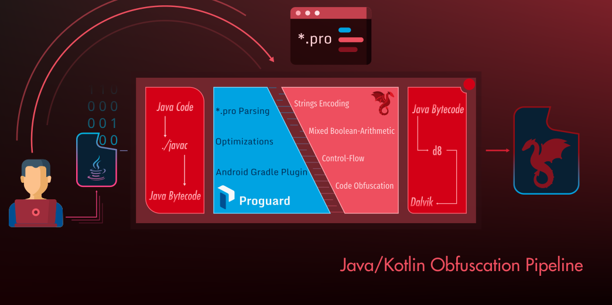

<p align="center">
  <br />
  <br />
  <a href="https://obfuscator.re/dprotect">
    
  </a>
</p>

<p align="center">
  <a href="LICENSE">
    
  </a>
</p>

dProtect is an extension of Proguard with enhanced code obfuscation features. While Proguard is known for obfuscating
symbols (package names, class names, ...) and optimizing Java/Kotlin code, dProtect brings code obfuscation
for Java and Kotlin on the top of Proguard:

```bash
# Arithmetic Obfuscation
-obfuscate-arithmetic,low class dprotect.examples.**
-obfuscate-arithmetic,high,skipfloat class dprotect.internal.**

# Strings Obfuscation
-obfuscate-strings class dprotect.examples.**
-obfuscate-strings class dprotect.internal.CheckPassword {
    public static java.lang.String getPassword();
    public static java.lang.String getLogin();

    private static java.lang.String KEY;
}

# Control-flow obfuscation
-obfuscate-control-flow class dprotect.internal.api.**

# Constants Obfuscation
-obfuscate-constants class dprotect.internal.api.Enum {
  *;
}
```

dProtect follows the same integration mechanism as Proguard such as it can be instantiated in an Android
Gradle-based project as follows:

<h6>build.gradle</h6>

```gradle
buildscript {
    repositories {
        mavenCentral()
        maven {
          url = uri("https://maven.pkg.github.com/open-obfuscator/dProtect")
          credentials {
              username = "your-username"
              password = "the-token"
          }
        }
    }
    dependencies {
        classpath 're.obfuscator:dprotect-gradle:1.0.0'
    }
}
```

**You need to generate a Github token to use `maven.pkg.github.com`**. Alternatively,
you can use the `dprotect-gradle-1.0.0.jar` archive of the release's artifacts.

<h6>app/build.gradle</h6>

```gradle
apply plugin: 're.obfuscator.dprotect'
// ...
dProtect {
    configurations {
      release {
          configuration 'dprotect-rules.pro'
      }
    }
}
```



You can also find out more information here: https://obfuscator.re/dprotect

### Contact

You can reach out by email at this address: `ping@obfuscator.re`

#### Maintainers

- [Romain Thomas](https://www.romainthomas.fr): [@rh0main](https://twitter.com/rh0main) - `me@romainthomas.fr`

#### Credits

- [Guardsquare](https://www.guardsquare.com/): Proguard's Owner
- [Eric Lafortune](https://www.lafortune.eu/): Proguard's Author
- [James Hamilton](https://jameshamilton.eu/): Proguard's Core dev/maintainer

### License

dProtect is released under the same License as Proguard: [GNU General Public License v2.0](https://github.com/Guardsquare/proguard/blob/master/LICENSE)
